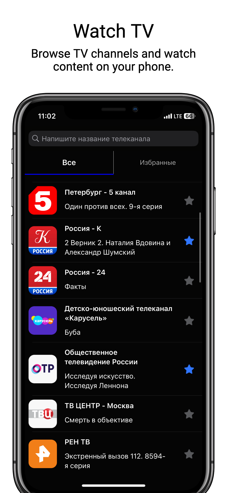
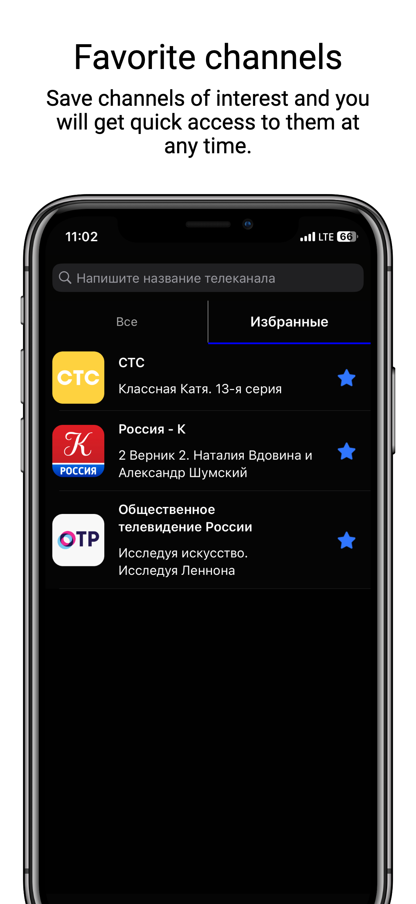

# ``iTV``

Discover and watch your favorite shows.

## Overview

iTV is an iOS app that allows users to watch TV content from streaming services.

### Features

- Fetching a list of TV channels from network API.
- Batch inserts to Core Data persistent storage using ``NSBatchInsertRequest``.
- Pin your favorite channels.

<table>
<tr>
<td></td>
<td></td>
</tr>
</table>

### Documentation

iTV' Swift-DocC documentation is [available here](https://leonidcbr.github.io/iTV/documentation/itv).
